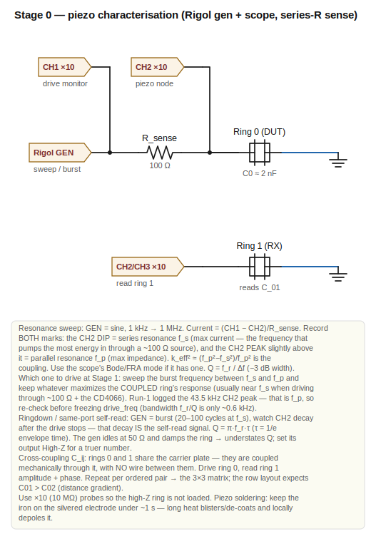
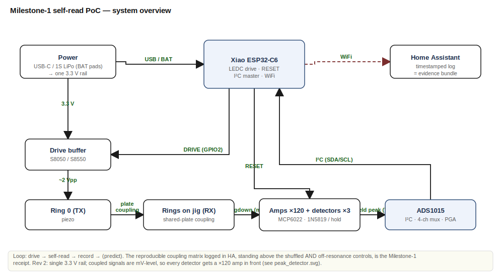
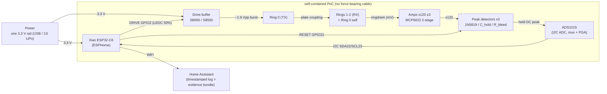
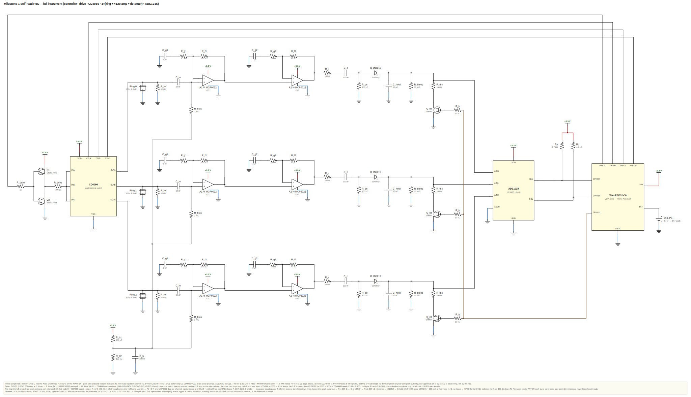
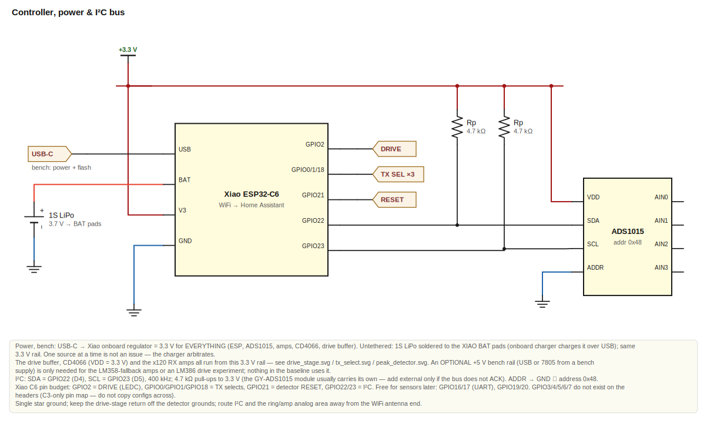
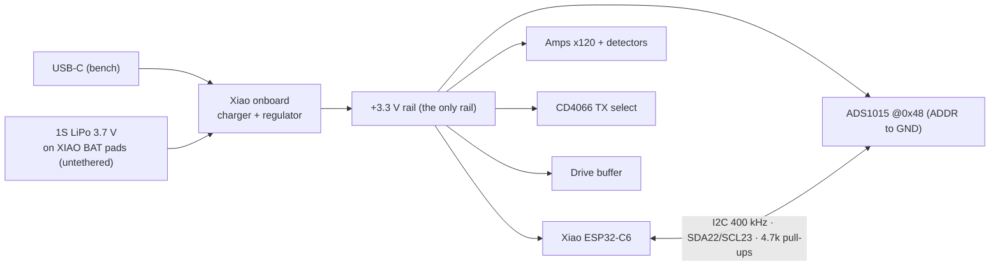
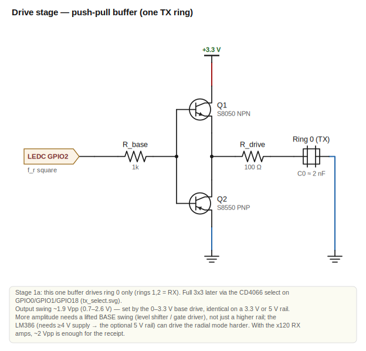
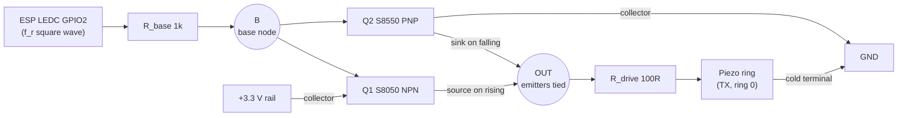
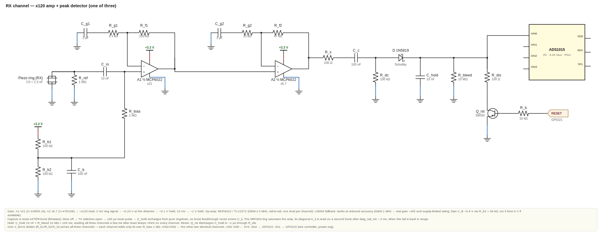
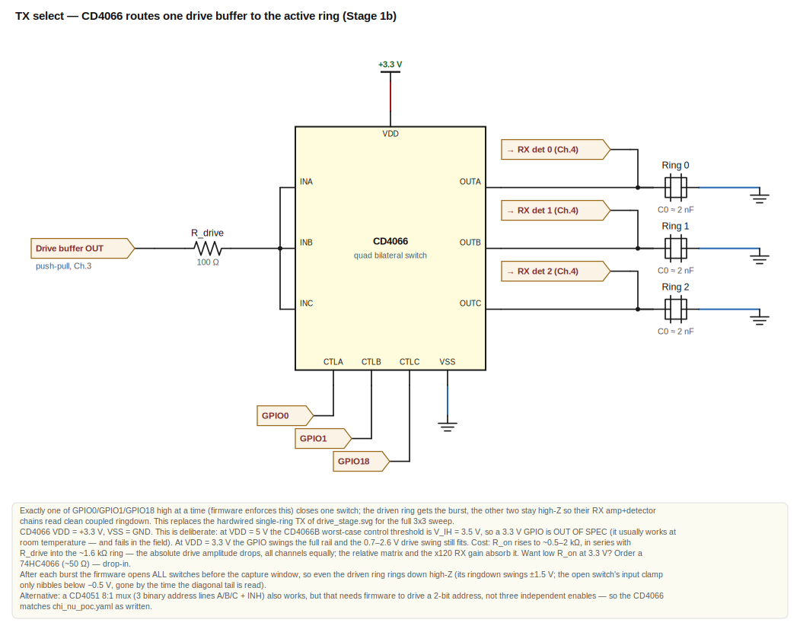

# Milestone-1 Electronics

All the electronics subsystems of the self-read PoC, as chapters. Each chapter
opens with its connection diagram — **click a diagram to open the full-size SVG**.

Mechanical jig: `milestone1_jig.scad`. Firmware/logging: `chi_nu_poc.yaml`.
Staged build walkthrough: `MILESTONE_1_build.md`. All parts are from your stock.

**Contents**
1. [Characterize the rings (Stage 0)](#1-characterize-the-rings-stage-0)
2. [System overview](#2-system-overview)
3. [Controller, power & I²C bus](#3-controller-power--ic-bus)
4. [Drive stage](#4-drive-stage)
5. [Peak detector (RX)](#5-peak-detector-rx)
6. [TX select (Stage 1b)](#6-tx-select-stage-1b)

---

## 1. Characterize the rings (Stage 0)

[](stage0_characterization.svg)

*Click to open `stage0_characterization.svg` full-size — generated from
`schematic/stage0_characterization.sch` (relative/anchored placement).*

Before any custom electronics, measure the bare rings on the bench. This is
**Stage 0** of the [build walkthrough](MILESTONE_1_build.md) — pure
characterisation with no soldered circuit beyond a single series resistor. It
fixes the two numbers every later chapter leans on: the resonance `f_r` that
sets the drive frequency in [Chapter 4](#4-drive-stage), and the static `C0`
that sizes the hold cap in [Chapter 5](#5-peak-detector-rx). It is genuinely
useful even if you stop here for the day. You need a signal generator and an
oscilloscope — the **Rigol MHO954** is both.

### The rig — one series sense resistor

The ring is electrically a small capacitor `C0 ≈ 2 nF` with sharp *motional*
resonances on top. To see them, drive it through a series **R_sense** and watch
two nodes:

- **CH1** (×10 probe) on the **drive node** — the generator output.
- **CH2** (×10 probe) on the **piezo node** — between R_sense and the ring.

The current into the ring is `(CH1 − CH2)/R_sense`. The ring's **cold** face goes
to GND, common with the generator ground. That is the whole circuit; the three
measurements below all reuse it.

| Ref | Part | Value | Why |
|---|---|---|---|
| R_sense | any ¼ W resistor | **100 Ω** | turns ring current into a CH2 voltage; matches the Stage-0 series R |
| Probes | ×10 (10 MΩ) | — | a ×1 probe's 1 MΩ would load the high-Z ring and flatten Q |
| GND | — | — | ring cold face → common gen/scope ground |

> **⚠ Solder the rings gently.** The electrode is a thin silvered film on the
> ceramic — keep the iron on it **under ~1 s**. Lingering heat blisters and
> de-coats the patch and can locally depole the ceramic. A ring with a small
> de-coated spot is still usable for first tests — bridge it with a thin ring of
> solder to the surrounding intact electrode — but expect a slightly lower Q and
> weaker coupling from it, so don't make it your reference ring.

### Use 1 — find the resonances (`f_s`, `f_p`, `Q`)

Generator = **sine**, sweep **1 kHz → 1 MHz** at ~1–2 Vpp, watch CH2. Each mode
leaves **two marks, record both**:

- **CH2 dip = series resonance `f_s`** — ring impedance minimum → current
  maximum. This is the frequency at which a low-impedance source (the ~100 Ω
  rig, or the Stage-1 buffer + CD4066) pumps the **most energy into the ring**.
- **CH2 peak = parallel resonance `f_p`, slightly above `f_s`** — impedance
  maximum. An open-circuit *receiver* responds strongest near here. The spacing
  gives the electromechanical coupling: `k_eff² ≈ (f_p² − f_s²)/f_p²`.

The **phase flips** near both. Expect a **radial mode ~20–70 kHz** and a
**thickness mode at a few hundred kHz**. If the scope has a **Bode / FRA**
(frequency-response) function, use it — it auto-sweeps gain + phase and shows
the dip/peak pair directly. Read `Q = f_r / Δf` from the −3 dB width of either
mark.

> **⚠ Which frequency to drive at (Run-1 erratum).** Run 1 logged only the CH2
> *peak* (43.5 kHz) — that is `f_p`, not `f_s`. With Q ≈ 75 the bandwidth is
> only ~0.6 kHz, and TX energy transfer through a ~100 Ω source peaks near
> `f_s`, which sits a few % *below* `f_p` for these rings. Before freezing the
> Stage-1 `drive_freq`, sweep the burst frequency between `f_s` and `f_p` and
> keep whatever **maximizes the coupled RX amplitude** (expect it near `f_s`;
> the C_ij values may come out several × larger than the Run-1 numbers).

### Use 2 — ringdown (`Q`, and the same-port self-read)

Same rig, generator = **burst** (20–100 cycles at `f_s`, low repeat rate). Watch
CH2 *after* the drive stops: a **decaying sinusoid** — that decay **is** the
self-read signal. `Q = π·f_r·τ`, where `τ` is the 1/e envelope time; cross-check
it against the sweep value. Note: an idle generator usually holds **50 Ω** to
ground, which damps the ring and *understates* Q — set the output to **High-Z**
for a truer number.

### Use 3 — cross-coupling matrix `C_ij`

Mount the rings in the jig on the **shared carrier plate** — the plate is the
coupling medium, and there is **no wire** between rings. Drive ring 0 through
R_sense; read **ring 1's** hot node on CH2/CH3 (its cold face → common GND).
Record **amplitude and phase** at the drive frequency for each ordered pair →
the 3×3 matrix by hand. In the `row` jig layout, expect a distance gradient
(**C01 > C02**).

### Stage-0 output (what to record)

Per ring: **`f_s` and `f_p` for the radial mode** (dip *and* peak — see the
erratum above), `f_thickness`, `Q`, ringdown `τ`, static `C0` (DMM capacitance
mode, well below resonance — expect ~1.5–3 nF; Run 1 measured 2.26 nF), plus the
**3×3 cross-coupling matrix**. That fixes the Stage-1 drive frequency and
confirms the rings are usable before you build a single buffer. No voltage here
exceeds a few volts — ordinary bench safety.

---

## 2. System overview

[](system_overview.svg)

*Click to open `system_overview.svg` full-size — generated from
`schematic/system_overview.sch` (relative/anchored block placement).*

<details><summary>Inline Mermaid version (legacy — kept for now)</summary>

> Text-based topology, renders natively on GitHub. Superseded by the generated SVG
> above (maintainable source: `schematic/system_overview.sch`); kept for a few
> iterations, slated for removal.



</details>

How the subsystems connect into one bounded, self-reading object.

### Signal / data flow

The loop **drive → self-read → record → (predict)** lives entirely on the object:
the Xiao drives a ring, the rings couple through the shared plate, the detectors
hold each response, the ADS digitizes, and HA records it with timestamps. That
recorded, reproducible coupling matrix is the Milestone-1 self-read receipt.

### Where things live

| Block | Location | Key parts |
|---|---|---|
| Carrier + ring jig | `milestone1_jig.scad` | 3D print, 3 piezo rings |
| Drive stage | Chapter 4 | S8050/S8550, R_base 1k, R_drive 100Ω (your stock) |
| TX select (full 3×3, Stage 1b) | Chapter 6 | CD4066 quad bilateral switch, VDD = 3.3 V |
| Ring → **×120 amp** → peak detector ×3 | Chapter 5 | **MCP6022/TLV2372 ×3 (order)**, 1N5819, 10 nF, 10 MΩ, reset NPN |
| ADC | Chapter 3 | GY-ADS1015 (I²C, mux, PGA) |
| Controller / power / bus | Chapter 3 | Xiao ESP32-C6; USB-C (bench) / 1S LiPo on BAT pads (untethered) |
| Firmware / logging | `chi_nu_poc.yaml` | ESPHome → Home Assistant |
| Whole build, staged | `MILESTONE_1_build.md` | — |

### Pin map (summary)

> **⚠ Corrected 2026-07-05 — this is the real XIAO ESP32-C6 pinout.** The C6
> module exposes only GPIO 0, 1, 2, 21, 22, 23, 16, 17, 18, 19, 20. The earlier
> map (GPIO3/4/5 select, GPIO6/7 I²C) was the XIAO ESP32-**C3** pinout; on the
> C6 those pins are not on the headers at all (GPIO3 powers the RF switch).

| Xiao pin | Net | Block |
|---|---|---|
| GPIO2 (D2) | DRIVE (LEDC, 50 % duty) | drive stage |
| GPIO21 (D3) | RESET | peak detectors |
| GPIO22 / GPIO23 (D4/D5) | SDA / SCL | ADS1015 |
| GPIO0 / GPIO1 / GPIO18 (D0/D1/D10) | TX0/TX1/TX2 select | full-matrix TX select (Stage 1b) |
| 3V3 / GND | the one rail | all |

### What completes Milestone 1 (receipt)

1. **Coupling matrix** logged in HA — at Stage 1a, column 0 (C00, C01, C02);
   reproducible across repeats (R_U).
2. **Same-port readback** — C00 with the reset-after-drive sequence.
3. **Clear separation** of the active matrix from **both controls**: the
   shuffled (no-drive) control *and* the off-resonance control — the latter
   carries the same electrical feedthrough but no mechanical resonance, so it
   is what proves the matrix is *coupling*, not crosstalk.

No weighing, no lift claim — this proves the self-reading object exists. The
record-level ΔS it later yields is what lets us check the ΔS-estimator bridge
empirically (see `ANS:/reply_to_bmu.md`).

### Build order (fastest path, parts on hand)

1. Print the jig (`milestone1_jig.scad`); solder ring leads.
2. Stage 0 on the Rigol → f_s + f_p, ringdown, cross-coupling (no electronics).
3. Power + Xiao + I²C + ADS (Chapter 3); confirm 0x48 in the boot log.
4. One drive buffer (Chapter 4) + three amp+detector channels (Chapter 5).
5. Flash `chi_nu_poc.yaml`; **Sweep**, then **Sweep (shuffled control)** and
   **Sweep (off-resonance control)**; confirm the matrix stands above both
   controls → receipt.

### Full instrument

[](full_instrument.svg)

---

## 3. Controller, power & I²C bus

[](controller_power.svg)

*Click to open `controller_power.svg` full-size — generated from
`schematic/controller_power.sch` (relative/anchored placement).*

<details><summary>Inline Mermaid version (legacy — kept for now)</summary>

> Power tree + I²C bus, text-based. Superseded by the generated SVG above
> (maintainable source: `schematic/controller_power.sch`); kept for a few
> iterations, slated for removal.



</details>

The Xiao ESP32-C6, its supply, the I²C link to the ADS1015, decoupling, and
grounding.

### Power: one 3.3 V rail, two sources

> **Rev 2 (2026-07-05) — the 2S + 7805 plan is gone, deliberately.** Three
> reasons: **(1)** a 7805 needs ≥ ~7 V in (2 V dropout); a "7.4 V" 2S LiPo
> spends most of its discharge curve at 6.6–7.4 V, so the 5 V rail would sag
> out of regulation. **(2)** an AMS1117-3.3 fed from 7.4 V dissipates
> (7.4−3.3 V)·0.35 A ≈ 1.4 W at WiFi peaks — far past a SOT-223 without a
> plane. **(3)** the 5 V rail bought nothing: the push-pull output swing is
> capped at 0.7–2.6 V by its 0–3.3 V *base* drive, not by the rail (Chapter 4).
> Everything now runs from one 3.3 V rail, which the Xiao itself provides.

**Bench (Milestone 1 — cables are fine here):**
- USB-C into the Xiao → its onboard regulator gives **3.3 V** to the ESP,
  ADS1015, the six amp op-amps, the CD4066, and the drive buffer.

**Untethered (later, for the balance run — no cables):**
- A **1S LiPo (3.7 V) soldered to the XIAO BAT pads** on the module's underside.
  The Xiao's onboard charger manages it (charges over USB-C), and the same
  3.3 V rail comes out — zero extra parts.

| Rail | Source (bench) | Source (untethered) | Feeds |
|---|---|---|---|
| +3.3 V | Xiao onboard regulator (USB) | 1S LiPo on BAT pads | everything |
| +5 V (optional) | USB 5 V pad / bench supply | — (not needed) | only the LM358-fallback amps or an LM386 drive experiment |
| GND | common star | common star | everything |

### Pin map (Xiao ESP32-C6 — real header pins)

| Pin | Net | Goes to |
|---|---|---|
| GPIO2 (D2) | DRIVE (LEDC, 50 % duty) | drive buffer base (R_base) — Chapter 4 |
| GPIO0 / GPIO1 / GPIO18 (D0/D1/D10) | TX0/TX1/TX2 | CD4066 controls — Chapter 6 (Stage 1b) |
| GPIO21 (D3) | RESET | all peak-detector reset bases (10 kΩ each) — Chapter 5 |
| GPIO22 (D4) | SDA | ADS1015 SDA |
| GPIO23 (D5) | SCL | ADS1015 SCL |
| 3V3 | +3.3 V | ADS VDD, amps, CD4066 VDD, drive buffer |
| BAT pads (underside) | battery | 1S LiPo (untethered mode) |
| GND | GND | common star |

> These match `chi_nu_poc.yaml` (rev 2). For Stage 1a (fixed TX) only GPIO2,
> GPIO21, GPIO22, GPIO23 are needed; GPIO0/1/18 stay free until the full-matrix
> select. Free for later sensors: GPIO16/17 (UART), GPIO19/20.
> **Do not copy a XIAO ESP32-C3 pin map onto this board** — GPIO3/4/5/6/7 are
> not on the C6 headers (GPIO3 powers the C6's RF switch).

### I²C bus

- ADS1015 address **0x48** → tie its **ADDR pin to GND**.
- **SDA = GPIO22, SCL = GPIO23** (the C6's default I²C pins, D4/D5), 400 kHz.
- **Pull-ups: 4.7 kΩ on SDA→3.3 V and SCL→3.3 V.** The GY-ADS1015 module usually
  has these onboard — check; add external 4.7 kΩ only if the bus doesn't ACK.
- Keep I²C wires short; route them away from the drive/ring leads.

### Decoupling & grounding

- **100 nF** ceramic right at each IC's VDD–GND (Xiao 3V3, ADS1015 VDD, drive
  buffers +5 V). Use them generously.
- **10 µF** bulk on each rail (+5 V and +3.3 V) near where it enters the board.
- **Single star ground.** Tie ADS GND, ESP GND, detector grounds, drive-buffer
  GND, and battery/USB GND to one point. Keep the drive stage's current-pulse
  return off the long thin traces shared with the detector grounds.
- The ESP is WiFi — keep the antenna end clear of the ring/detector analog area, and
  lean on the lock-in/ABBA + shuffle control to reject any pickup.

### Build order

1. Lay the GND star and the +3.3 V / +5 V rails first; add bulk 10 µF + 100 nF.
2. Power the Xiao (USB), confirm 3.3 V and 5 V pads with the DMM.
3. Wire I²C to the ADS1015; confirm the ESP sees it at 0x48 (ESPHome boot log).
4. Add the reset line (GPIO21) and the detector reset bases.
5. Then the drive stage (Chapter 4) and detectors (Chapter 5).

---

## 4. Drive stage

[](drive_stage.svg)

*Click to open `drive_stage.svg` full-size — generated from
`schematic/drive_stage.sch` (relative/anchored placement).*

<details><summary>Inline Mermaid version (legacy — kept for now)</summary>

> Push-pull buffer topology (RKM values, e.g. `100R` = 100 Ω), text-based.
> Superseded by the generated SVG above (maintainable source:
> `schematic/drive_stage.sch`); kept for a few iterations, slated for removal.



</details>

Turns the ESP32 LEDC square wave (0–3.3 V logic) into enough current/voltage to
ring a piezo (~2 nF capacitive load) at its resonance. One buffer per TX ring.

### Topology: complementary emitter-follower (push-pull)

LEDC → R_base → shared base node → **S8050 (NPN, top)** + **S8550 (PNP, bottom)**
emitter-follower pair → OUT → R_drive → ring. The pair sources current to charge
the piezo cap and sinks it to discharge — exactly what a capacitive load needs.

| Ref | Part (your stock) | Value | Why |
|---|---|---|---|
| Q1 | S8050 NPN (J3Y) | — | sources current on the rising half |
| Q2 | S8550 PNP (2TY) | — | sinks current on the falling half |
| R_base | 1206 | **1 kΩ** | LEDC → both bases; limits base current |
| R_drive | 1206 | **100 Ω** | series to the ring: damps transients, limits peak current |
| Supply | 3.3 V rail | **+3.3 V** | follower rail; GND for the PNP collector — see swing note below |
| (opt.) D_ab ×2 | 1N4148 | — | class-AB bias between bases to soften crossover (optional) |

### What amplitude to expect

An emitter-follower loses ~0.6–0.7 V per Vbe, so a 0–3.3 V base drive gives an
output swing of roughly **0.7 V → 2.6 V (≈ 1.9 Vpp)**, with a crossover deadband
in the middle. **The swing is set by the base drive, not the rail** — a 5 V rail
gives exactly the same 0.7–2.6 V, which is why rev 2 runs the buffer from the
3.3 V rail (the NPN sits at V_CE ≈ 0.7 V at the top of the swing — still active,
not saturated). ~1.9 Vpp is plenty to *ring* a high-Q resonator at its f_r
(energy builds over ~Q cycles), and the ×120 RX amps (Chapter 5) handle the
small coupled signals. If you ever need more drive:

- **Lift the base swing** (level shifter or gate driver into a higher rail) —
  raising the rail alone does nothing, or
- **Use the LM386** (you have it) as the drive amp for the **radial mode** (tens
  of kHz): AC-couple LEDC in, set gain (20–200), big swing out. Note it needs a
  **≥ 4 V supply** — that is what the *optional* 5 V bench rail is for. Its
  ~300 kHz BW won't serve a ~400 kHz thickness mode — use the push-pull there.

Current is modest: `I_pk ≈ 2π·f·C0·V` ≈ 0.6 mA at 50 kHz sine, ~19 mA transient
on the square edges through R_drive (C0 ≈ 2.3 nF). R_drive = 100 Ω is
comfortable; decouple the rail with 10 µF + 100 nF at the transistors.

### TX selection — which ring is driven

Each ring is permanently wired to its own RX peak detector (Chapter 5). Driving one
ring at a time while the others stay clean RX inputs is the only fiddly part — so
stage it:

**Stage 1a (now): fixed TX.** One buffer drives **ring 0** only. Rings 1 & 2 are
RX-only; ring 0 also has a detector (self-read C00). You measure column 0 of the
matrix (C00, C01, C02) + the shuffle control. **That is already a valid Milestone-1
receipt** — reproducible coupling, a distance gradient, same-port readback, and a
control — with zero select hardware. Build this first.

**Stage 1b (full 3×3, later): add drive-side selection** — drawn in
[Chapter 6](#6-tx-select-stage-1b). Each idle buffer would otherwise hold its ring
near 0.7 V at low impedance and spoil that ring's RX read, so you need *true high-Z*
on the unselected rings. Cleanest options:

- **A CD4066 analog switch** routes the one buffer's output to the selected ring
  only; unselected rings see an open switch (high-Z). Driven by GPIO0/GPIO1/GPIO18,
  one enable per ring — this matches `chi_nu_poc.yaml`'s three independent TX
  enables, and is the circuit in Chapter 6. (Recommended.) A CD4051 8:1 mux also
  works but expects a binary address, not three enables, so it would need a
  firmware change.
- **Three buffers, firmware-tristated:** each ring its own buffer fed by its own
  LEDC pin; set the *unselected* drive GPIOs to **input/high-Z** (not LOW) so those
  buffers float off. Works, but a floating base picks up noise — less clean.

### Build steps (one buffer)

1. +3.3 V and GND rails on the protoboard (from the Xiao 3V3 pin — Chapter 3).
2. LEDC GPIO2 → **R_base 1 kΩ** → base node B.
3. B → **Q1 (S8050)** base and **Q2 (S8550)** base (bases tied).
4. Q1 collector → **+3.3 V**; Q2 collector → **GND**.
5. Q1 emitter + Q2 emitter → **OUT** (tied).
6. OUT → **R_drive 100 Ω** → ring 0 hot terminal (TX ring); ring cold → GND.
7. (Optional) two 1N4148 in series between the bases, biased from +3.3 V via a
   resistor, for class-AB — only if crossover distortion bothers you.

Decoupling: 100 nF + 10 µF across +3.3 V near the transistors.

### Sanity check

On the Rigol, scope OUT: a ~1.9 Vpp abrupt waveform at f_r during the burst (the
piezo edge looks rounded — that's the cap charging through R_drive). The RX rings
then show mV-level ringdown that scales with this drive amplitude — the ×120
amps of Chapter 5 exist precisely because it is mV-level.

---

## 5. Peak detector (RX)

[](peak_detector.svg)

*Click to open `peak_detector.svg` full-size — generated from
`schematic/peak_detector.sch` (relative/anchored placement).*

> **History.** Two earlier depictions of this channel —
> [`peak_detector_legacy.svg`](peak_detector_legacy.svg) (hand-drawn) and an
> inline Mermaid sketch — showed the **rev-1 amp-less detector** (ring → 1N5819
> → 1 nF hold). That circuit could not have read the measured 2–10 mV
> off-diagonals (see the rev-2 note below) and is kept only as history.

One per RX ring (×3). It turns the fast piezo ringdown (tens–hundreds of kHz,
decaying in ~ms) into a **held DC peak** the ADS1015 can read at its leisure. That
held value is one entry of the coupling matrix C_ij. The detector measures
*relative* amplitudes, so values are chosen for a clean, repeatable read — absolute
calibration is not needed for Milestone 1.

> **⚠ Rev 2 (2026-07-05) — why there is now an amplifier.** Stage 0 *measured*
> the coupled ring-to-ring signals: **10 mV (adjacent), 5 mV, 2 mV (weak/far
> cells)** at full drive. A 1N5819's forward knee is ~0.15–0.3 V; below that a
> bare diode detector is a square-law device whose output for a 2–10 mV input
> is fractions of a millivolt — at or under the ADS1015's LSB even at maximum
> PGA. **The rev-1 detector could not have read the off-diagonal matrix at
> all.** (The diagonal C_ii was never in danger — the driven ring rings down
> from ~1.5 V.) Fix: amplify each RX channel ~**×120** *before* the diode, with
> a two-stage single-supply op-amp front end. 2 mV → ~0.24 V at the detector;
> 10 mV → ~1.2 V. The 0.2–0.3 V diode drop is then a fixed, repeatable offset
> instead of a wall.

### Step 0 — measure your ring first (2 numbers set everything)

1. **Static capacitance C0** — multimeter cap mode (or the Rigol) across one ring,
   well below resonance. Expect **~1.5–3 nF** for a 38 mm / 5 mm PZT ring. (Design
   assumes C0 ≈ 2 nF; adjust C_hold if very different — see Tuning.)
2. **Resonance f_r and ringdown** — from Stage-0 on the Rigol. Expect a radial mode
   ~**40–70 kHz** and a thickness mode a few hundred kHz. Note the RX peak amplitude.

The ring is electrically a small capacitor C0 with a sharp motional resonance; its
**source impedance** near resonance is roughly `Z ≈ 1/(2π·f_r·C0)`:

| f_r | Z (C0 = 2 nF) |
|---|---|
| 50 kHz | ~1.6 kΩ |
| 100 kHz | ~0.8 kΩ |
| 400 kHz | ~0.2 kΩ |

This low source impedance lets the detector charge a small hold cap fast.

### The chain (per RX channel)

```
ring hot H ─ R_ref 1M ─ GND
      H ─ C_in 10n ─→ A1 (×21) ─→ A2 (×5.7) ─ R_s 100Ω ─ C_c 100n ─┬─ D 1N5819 ─→ N
                     (non-inv., biased V_BIAS)          R_dc 100k ─┤              │
                                                              GND ─┘   C_hold 10n ┼ R_bleed 10M ┼ (R_dis 100Ω + Q_reset) → GND
                                                                       N → ADS1015 AINx
```

| Ref | Part | Value | Why |
|---|---|---|---|
| R_ref | 1206 (stock) | **1 MΩ** | DC-references the ring's hot node |
| C_in | 1206 (stock) | **10 nF** | AC-couples ring → amp (16 Hz HPF vs 1 MΩ bias) |
| A1, A2 | **MCP6022 / TLV2372** (order; one dual per channel) | ×21, ×5.7 | GBW ≥ 3 MHz rail-to-rail; gains 1+100k/5.1k and 1+47k/10k → **~×120** |
| R_bias | 1206 | **1 MΩ** | biases A1.in+ from the shared V_BIAS node |
| V_BIAS divider | 2× 100 kΩ + 100 nF | 1.65 V | **one divider serves all three channels** |
| R_g1/C_g1, R_g2/C_g2 | 5.1k + 1 µF, 10k + 1 µF | — | AC gain only (DC gain 1 → output idles at V_BIAS) |
| R_f1, R_f2 | 100 kΩ, 47 kΩ | — | feedback |
| R_s | 1206 | **100 Ω** | isolates the op-amp from the diode/cap load |
| C_c | 1206 | **100 nF** | AC-couples amp → detector (ground-referenced) |
| R_dc | 1206 | **100 kΩ** | DC return at the diode anode |
| D | **1N5819** (SS14, stock) | — | low drop + fast; *not* 1N4007 |
| C_hold | 1206 (stock) | **10 nF** | hold τ with R_bleed = **100 ms** → <6 % droop over the 3 sequential reads |
| R_bleed | 1206 (stock) | **10 MΩ** | hold decay |
| Q_reset + R_base + R_dis | S8050 + 10 kΩ + 100 Ω (stock) | — | GPIO21 shorts C_hold (τ ≈ 1 µs) between captures |

Time constants: amp output charges C_hold through R_s + D within a couple of
cycles; hold `τ = 10 MΩ · 10 nF = 100 ms`; reset discharge `τ = 100 Ω · 10 nF =
1 µs` (the firmware's 100 µs pulse is generous).

> **LM358 fallback (stock, works today, less clean):** same topology, but its
> 1 MHz GBW means the nominal ×21 stage really delivers ~×11 at 43.5 kHz — total
> ~×55, temperature-dependent at the %-level — and on 3.3 V its output ceiling
> is ~1.9 V, so set V_BIAS ≈ 0.9 V (R_b2 = 39 kΩ) or run the amps from the
> optional 5 V bench rail. Fine for first light; swap to MCP6022 for the
> archived receipt. **Not** the UA741 (needs ± supplies, too slow).

### Bill of materials (all 3 RX channels)

| Qty | Part | Source |
|---|---|---|
| 3 | MCP6022 or TLV2372 (dual RRIO op-amp) | **order** (LM358 = stock fallback) |
| 3 | 1N5819 Schottky | stock (SS14) |
| 3+1 | 10 nF (C_in ×3, C_hold ×3) — 6 total | stock 1206 |
| 3 | 100 nF (C_c) + 1 for V_BIAS | stock 1206 |
| 6 | 1 µF (C_g1, C_g2) | stock 1206 |
| 3 | 10 MΩ (R_bleed) · 3× 1 MΩ (R_ref) · 3× 1 MΩ (R_bias) | stock 1206 |
| 3 ea | 100 kΩ (R_f1), 47 kΩ (R_f2), 100 kΩ (R_dc), 5.1 kΩ (R_g1), 10 kΩ (R_g2) | stock 1206 |
| 3 ea | 100 Ω (R_s), 100 Ω (R_dis), 10 kΩ (R_base) | stock 1206 |
| 3 | NPN (Q_reset) S8050/2N3904 | stock |
| 2 | 100 kΩ (V_BIAS divider) + 100 nF | stock |

> The three Q_reset bases share one GPIO (reset all detectors together) via
> three 10 kΩ resistors — matching the single `pk_reset` line in
> `chi_nu_poc.yaml`. The V_BIAS divider is also shared.

### Build steps (one channel, then ×3)

1. **GND rail**; tie ADS GND, ESP GND, all "→ GND" legs to it (short, star-ish).
2. Build the shared **V_BIAS divider** (100k/100k from 3.3 V, 100 nF to GND).
3. RX ring **cold** → GND. RX ring **hot** → node H; **R_ref (1 MΩ) → GND** at H.
4. H → **C_in 10 nF** → A1.in+; **R_bias 1 MΩ** from V_BIAS to A1.in+.
5. A1: R_f1 100k out→in−; R_g1 5.1k + C_g1 1 µF from in− to GND. Supply 3.3 V,
   100 nF at the pins. A1.out → A2.in+ (DC-coupled).
6. A2: R_f2 47k out→in−; R_g2 10k + C_g2 1 µF from in− to GND.
7. A2.out → **R_s 100 Ω** → **C_c 100 nF** → diode anode node; **R_dc 100 kΩ**
   from that node to GND; **D (1N5819)** cathode → node N.
8. At N: **C_hold (10 nF) → GND**, **R_bleed (10 MΩ) → GND**, **R_dis (100 Ω) →
   Q_reset collector**; Q_reset emitter → GND; base → **R_base (10 kΩ)** → GPIO21.
9. N → **ADS1015 AINx**. Repeat into AIN1, AIN2.

### Capture timing — reset AFTER the burst (both matrix types)

Rev 2 firmware captures **everything after drive-off**: burst → drive off → all
TX switches opened → **~120 µs later a 100 µs `pk_reset` pulse** dumps whatever
the burst coupled in electrically → C_hold then recharges from **pure
mechanical ringdown** → settle → read. Electrical feedthrough therefore never
enters C_ij — and the **off-resonance control** (same burst amplitude at
~29 kHz) verifies that, because it carries the same feedthrough but no
resonance.

**The diagonal C_ii** needs one extra step: during its own burst the driven
ring's amp is saturated (1.5 V × 120 ≫ rail), so the same-port read happens on
a **second burst** whose reset fires `diag_tail_ms ≈ 3 ms` after drive-off —
by then the ringdown (τ = Q/πf ≈ 0.55 ms) is back inside the amp's range and
the held tail is a clean, state-dependent self-read number. Tune 2–5 ms per
ring; C_ii volts are a *separate scale* from off-diagonal volts (tail vs peak) —
compare C_ii only with C_ii across repeats and controls.

### Tuning guide

| Symptom | Fix |
|---|---|
| Off-diagonals too small / noisy | raise ADS PGA (gain 0.512/0.256); check V_BIAS; check C_in orientation/route |
| ADS clips (full-scale) | drop PGA to 2.048; or reduce R_f2 (47k → 22k, gain ×2.9) |
| Amp output clips on the strongest cell | reduce R_f2 as above — keep all three channels at the SAME gain |
| Reading droops before read | shouldn't with τ = 100 ms — check R_bleed value and ADS single-shot mode |
| Diagonal reads ~rail | increase `diag_reset` tail delay (amp still saturated) |
| Diagonal reads ~0 | decrease the tail delay (ringdown already gone) |
| Everything reads ~0 in ACTIVE | drive frequency off resonance — redo the f_s/f_p sweep (Ch. 1 erratum) |
| Weak cells wander over an hour, strong cells don't | that's the diode-knee tempco, not a build fault — interleave controls + log temperature (noise budget below) |

### What "good" looks like

- Amp output on the scope: a clean ×~120 copy of the ringdown, idling at V_BIAS.
- Detector DC output **tracks** the RX ringdown amplitude on the scope.
- Off-diagonals show the expected **distance gradient** in the row layout (C01 > C02).
- The **shuffled control** reads near baseline, the **off-resonance control**
  reads near baseline *despite full drive amplitude*, both clearly below the
  active matrix. That separation is the Milestone-1 receipt
  (quantitative pass thresholds: `MILESTONE_1_build.md` §1.1).

### Noise & drift budget — what actually limits the weakest cell

Chain arithmetic for the Run-1 signal levels (×120 amp, 1N5819 knee
≈ 0.15–0.25 V at these currents, ADS1015 @ PGA 1.024 → 0.5 mV/LSB):

| Cell class (Run-1) | at ring | after ×120 | held DC (− knee) | in ADC LSB |
|---|---|---|---|---|
| weak / far (2 mV) | 2 mV | 0.24 V | **~0.04–0.09 V** | ~80–180 |
| mid (5 mV) | 5 mV | 0.60 V | ~0.35–0.45 V | ~700–900 |
| strong adjacent (10 mV) | 10 mV | 1.20 V | ~0.95–1.05 V | ~1900–2100 |

Noise sources, in order of *irrelevance*:

- **ADS input noise** ~1–2 LSB (0.5–1 mV) — sets the shuffle-control σ; even
  the weak cell sits ~40σ up. Statistical separation is never the problem.
- **Amp chain noise** — MCP6022 input noise (~9 nV/√Hz) × √(500 kHz) × 120
  ≈ 0.7 mV rms at the detector; a peak detector rides ~+2σ of that (~+1.5 mV)
  *identically on every cell* — a common offset, harmless to the matrix.
- **Johnson noise** of the 1 MΩ reference is shunted by the ring's ~1.6 kΩ
  source impedance in-band — negligible.

The one that matters: **the Schottky knee's temperature coefficient**,
≈ −1…−2 mV/°C of held value. On the strong cell that is 0.1 %/°C — invisible.
On the **weak** (~40–90 mV) cell it is **~2–5 %/°C**: an hour-long receipt run
in a room that drifts a few °C would eat the whole 10 % repeatability budget
*as a slow systematic*. Mitigations (all three are cheap, use all three):

1. **Interleave the controls** (A-S-A-O per repeat — `MILESTONE_1_build.md`
   §1.1 A5): drift then moves active and control readings together and cancels
   in the separation test.
2. **Log temperature with every sweep** (DS18B20, or the 1N4148-on-a-spare-ADC
   trick from the parts table) — drift becomes a *labeled regressor* in the
   evidence bundle instead of an anonymous wobble.
3. Judge each cell against its **own** repeat series (per-cell CV), never
   against another cell's scale — already the A2/A6 rule.

WiFi/EMI pickup is excluded by construction rather than by budget: the
reset-after-burst sequence dumps anything the burst coupled electrically, and
the off-resonance control carries the *same* feedthrough with no resonance —
if EMI were the signal, that control would show it.

---

## 6. TX select (Stage 1b)

[](tx_select.svg)

*Click to open `tx_select.svg` full-size — generated from
`schematic/tx_select.sch` (relative/anchored placement).*

**Not needed for the Stage 1a receipt** (one fixed buffer on ring 0 — Chapter 4).
This chapter draws the **drive-side selection** the full 3×3 sweep needs, so the
hardware matches what `chi_nu_poc.yaml` already drives: the firmware defines three
independent **TX enables** (`tx0/tx1/tx2` on **GPIO0/GPIO1/GPIO18** — the real
XIAO ESP32-C6 pins, see Chapter 3) and closes exactly one at a time. A **CD4066
quad bilateral switch** is the direct hardware for that — three of its four
switches, one control line each.

### Topology

One Chapter-3 push-pull buffer feeds **R_drive** into the CD4066's common input
bus (the three switch inputs tied together). Each switch output goes to one ring's
hot terminal; that same node is also the ring's RX node into its peak detector
(Chapter 5). Closing one switch puts ~2 Vpp on the selected ring; the other two
switches are **open → those rings are high-Z**, so their detectors read the clean
coupled ringdown instead of being clamped by an idle buffer.

| Ref | Part (your stock / order) | Role |
|---|---|---|
| SW | **CD4066** quad bilateral switch | routes the buffer to the selected ring; 3 of 4 switches used |
| (per ring) | the Chapter-4 RX detector | reads the same hot node when its switch is open |
| — | R_drive 100 Ω (from Chapter 4) | series damping into the common input bus |

### Power & logic levels

- **VDD = +3.3 V, VSS = GND** *(rev 2 — this replaces the earlier +5 V
  recommendation, which was out of spec).* At VDD = 5 V the CD4066B datasheet
  worst-case input-high threshold is **V_IH = 3.5 V**, so a 3.3 V GPIO is *not*
  guaranteed to switch it — typical parts work at room temperature and then
  fail with temperature/part lot. At VDD = 3.3 V the GPIO swings the full rail
  and the 0.7–2.6 V drive swing still fits inside VSS…VDD.
- The price is R_on: ~0.5–2 kΩ at 3.3 V (vs ~0.5 kΩ at 5 V), in series with
  R_drive 100 Ω into the ring's ~1.6 kΩ at resonance. That attenuates the
  absolute drive on all channels equally — the relative matrix is untouched and
  the ×120 RX amps absorb the rest. If you want low R_on at 3.3 V, order a
  **74HC4066** (~50 Ω) — pin-compatible.
- After each burst the firmware **opens all three switches** before the capture
  window, so even the driven ring rings down high-Z. (Its ±1.5 V ringdown pokes
  below VSS at the open switch; the input clamp nibbles the negative tips until
  the envelope is under ~0.5 V — gone well before the ~3 ms diagonal read.)
- One enable high at a time is enforced in firmware (`one_tx` clears all three,
  then sets one); no hardware interlock is required.

### Mapping to the firmware

| `chi_nu_poc.yaml` | This circuit |
|---|---|
| `tx0_pin: GPIO0` (D0) → "TX0 enable" | CD4066 control A → switch A → Ring 0 |
| `tx1_pin: GPIO1` (D1) → "TX1 enable" | CD4066 control B → switch B → Ring 1 |
| `tx2_pin: GPIO18` (D10) → "TX2 enable" | CD4066 control C → switch C → Ring 2 |

> **Alternative — CD4051 8:1 mux.** Also routes one source to one of several
> outputs, but it selects by a **binary address** (A/B/C + inhibit), not three
> independent enables. Using it would mean rewriting the firmware's three
> TX-enable switches as a 2-bit address — so the CD4066 is the drop-in match for
> the config as written.
